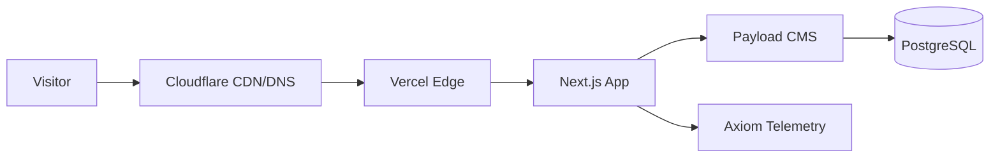
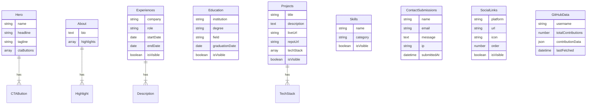
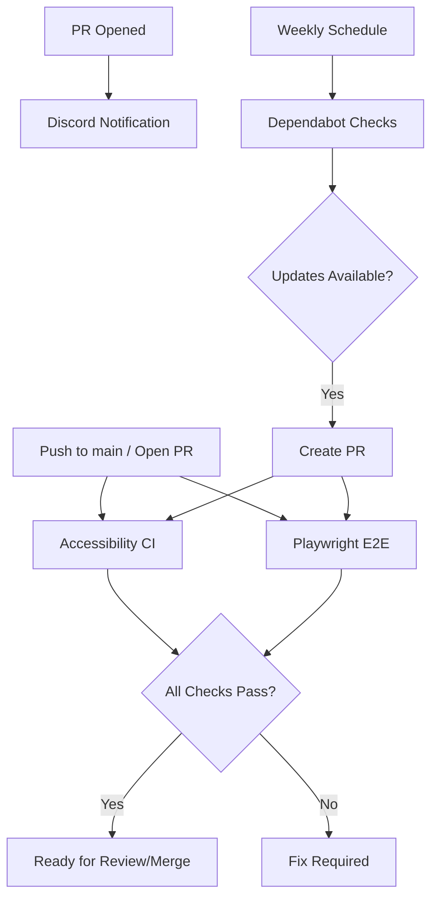

# ralton.dev

Personal portfolio website built with Next.js 15, Payload CMS 3, and Tailwind CSS.

[](https://github.com/bralton/personal_website/actions/workflows/accessibility.yml)
[](https://github.com/bralton/personal_website/actions/workflows/e2e.yml)

## Tech Stack

### Application


### Infrastructure


## Architecture



### Component Roles

| Component       | Role                                         |
| --------------- | -------------------------------------------- |
| **Cloudflare**  | CDN caching, DNS management, DDoS protection |
| **Vercel Edge** | Serverless deployment, edge functions, ISR   |
| **Next.js 15**  | React framework with App Router, RSC support |
| **Payload CMS** | Headless CMS with admin panel at `/admin`    |
| **PostgreSQL**  | Primary database (Neon/Vercel Postgres)      |
| **Axiom**       | Observability, logging, and telemetry        |

## Data Model



### Payload Collections & Globals

| Type           | Name               | Description                        |
| -------------- | ------------------ | ---------------------------------- |
| **Global**     | Hero               | Homepage hero section (singleton)  |
| **Global**     | About              | About section content (singleton)  |
| **Global**     | GitHubData         | Cached GitHub activity (singleton) |
| **Collection** | Projects           | Portfolio projects                 |
| **Collection** | Skills             | Technical skills with categories   |
| **Collection** | Experiences        | Work experience entries            |
| **Collection** | Education          | Educational background             |
| **Collection** | ContactSubmissions | Contact form submissions           |
| **Collection** | SocialLinks        | Social media links                 |
| **Collection** | Media              | Uploaded images and files          |
| **Collection** | Users              | Admin authentication               |

## Local Development

### Prerequisites

- **Node.js** 20+ (LTS recommended)
- **pnpm** 9+ (`npm install -g pnpm`)
- **PostgreSQL** 16+ (or use [Neon](https://neon.tech) free tier)

### Installation

```bash
# Clone the repository
git clone https://github.com/bralton/personal_website.git
cd personal_website

# Install dependencies
pnpm install
```

### Environment Setup

1. Copy the example environment file:

   ```bash
   cp .env.example .env.local
   ```

2. Fill in required variables (see [Environment Variables](#environment-variables))

3. Run database migrations:

   ```bash
   npx payload migrate
   ```

### Development Commands

| Command          | Purpose                              |
| ---------------- | ------------------------------------ |
| `pnpm dev`       | Start development server             |
| `pnpm build`     | Production build (requires database) |
| `npx next build` | Build without migrations             |
| `pnpm lint`      | Run ESLint                           |
| `pnpm format`    | Run Prettier                         |
| `pnpm test:e2e`  | Run Playwright E2E tests             |
| `pnpm devsafe`   | Dev with clean `.next` directory     |

> **Note:** `pnpm build` requires a running database for migrations. Use `npx next build` for local build verification without a database.

For additional development standards (imports, naming conventions, accessibility), see [CLAUDE.md](./CLAUDE.md).

## CI/CD



### Workflows

| Workflow             | Trigger           | Description                                     |
| -------------------- | ----------------- | ----------------------------------------------- |
| **Accessibility CI** | Push/PR to `main` | Lighthouse audit, sitemap/robots.txt validation |
| **Playwright E2E**   | Push/PR to `main` | End-to-end tests with Chromium                  |
| **PR Discord**       | PR opened         | Sends notification to Discord channel           |
| **Dependabot**       | Weekly (Monday)   | Checks npm and GitHub Actions for updates       |

### Accessibility CI Details

The accessibility workflow (`.github/workflows/accessibility.yml`) performs:

1. **Lighthouse Accessibility Audit** - Automated accessibility score validation
2. **Sitemap Validation** - Verifies `sitemap.xml` structure and required elements
3. **robots.txt Validation** - Confirms proper crawler directives

### Playwright E2E Details

The E2E workflow (`.github/workflows/e2e.yml`) runs:

1. Full application build with seeded test data
2. Playwright tests against Chromium
3. Artifact upload on failure for debugging

## Deployment

### Vercel Configuration

1. Connect your GitHub repository to Vercel
2. Set the framework preset to **Next.js**
3. Configure environment variables in Vercel dashboard
4. Deploy

### Cloudflare DNS Setup

1. Add your domain to Cloudflare
2. Point nameservers to Cloudflare
3. Create CNAME record pointing to Vercel:
   - Type: `CNAME`
   - Name: `@` (or subdomain)
   - Target: `cname.vercel-dns.com`

### Database Provisioning

Options:

- **Vercel Postgres** - Integrated with Vercel dashboard
- **Neon** - Free tier available at [neon.tech](https://neon.tech)

Both provide PostgreSQL 16+ with connection pooling.

## Environment Variables

| Variable                 | Purpose                            | Required   |
| ------------------------ | ---------------------------------- | ---------- |
| `DATABASE_URL`           | PostgreSQL connection string       | Yes        |
| `PAYLOAD_SECRET`         | Payload CMS encryption key         | Yes        |
| `PAYLOAD_PREVIEW_SECRET` | Preview mode security              | Yes        |
| `NEXT_PUBLIC_SERVER_URL` | Server URL for preview redirects   | Yes        |
| `NEXT_PUBLIC_SITE_URL`   | Canonical URL for SEO              | Yes        |
| `RESEND_API_KEY`         | Email notifications (contact form) | Production |
| `DISCORD_WEBHOOK_URL`    | Discord notifications              | Optional   |
| `ADMIN_EMAIL`            | Admin notification recipient       | Optional   |
| `GITHUB_TOKEN`           | GitHub API access                  | Yes        |
| `GITHUB_USERNAME`        | GitHub username for activity       | Yes        |
| `AXIOM_TOKEN`            | Axiom observability token          | Optional   |
| `AXIOM_DATASET`          | Axiom dataset name                 | Optional   |
| `CRON_SECRET`            | Cron job authentication            | Yes        |
| `ADMIN_ALLOWED_IP`       | IP allowlist for /admin access     | Production |

See [.env.example](./.env.example) for the complete template.

## Branch Protection (Ready to Enable)

> **Status:** These rules are documented and ready but cannot be enforced on private repositories with GitHub Free tier. Enable when the repository becomes public or the GitHub plan is upgraded.

### Recommended Settings for `main` Branch

| Setting                      | Value                                              | Rationale                      |
| ---------------------------- | -------------------------------------------------- | ------------------------------ |
| Require pull request reviews | 1 reviewer                                         | Code quality gate              |
| Dismiss stale PR approvals   | Yes                                                | Prevent bypass via new commits |
| Require status checks        | Yes                                                | Automated quality gates        |
| Status checks required       | `Lighthouse Accessibility Audit`, `Playwright E2E` | Comprehensive coverage         |
| Require branches up to date  | Yes                                                | Prevent merge conflicts        |
| Do not allow bypassing       | Yes                                                | Consistent enforcement         |

### Setup Instructions

1. Go to **Settings** > **Branches** > **Add rule**
2. Branch name pattern: `main`
3. Enable required settings (see table above)
4. Add status checks: `Lighthouse Accessibility Audit`, `Playwright E2E`
5. Click **Create**

For detailed step-by-step instructions, see [docs/branch-protection.md](./docs/branch-protection.md).

## License

This project is private. All rights reserved.
