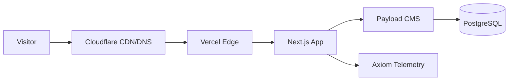
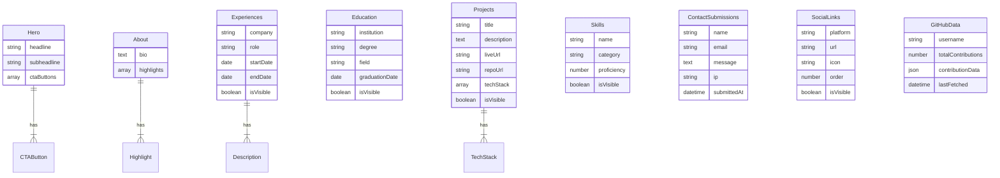
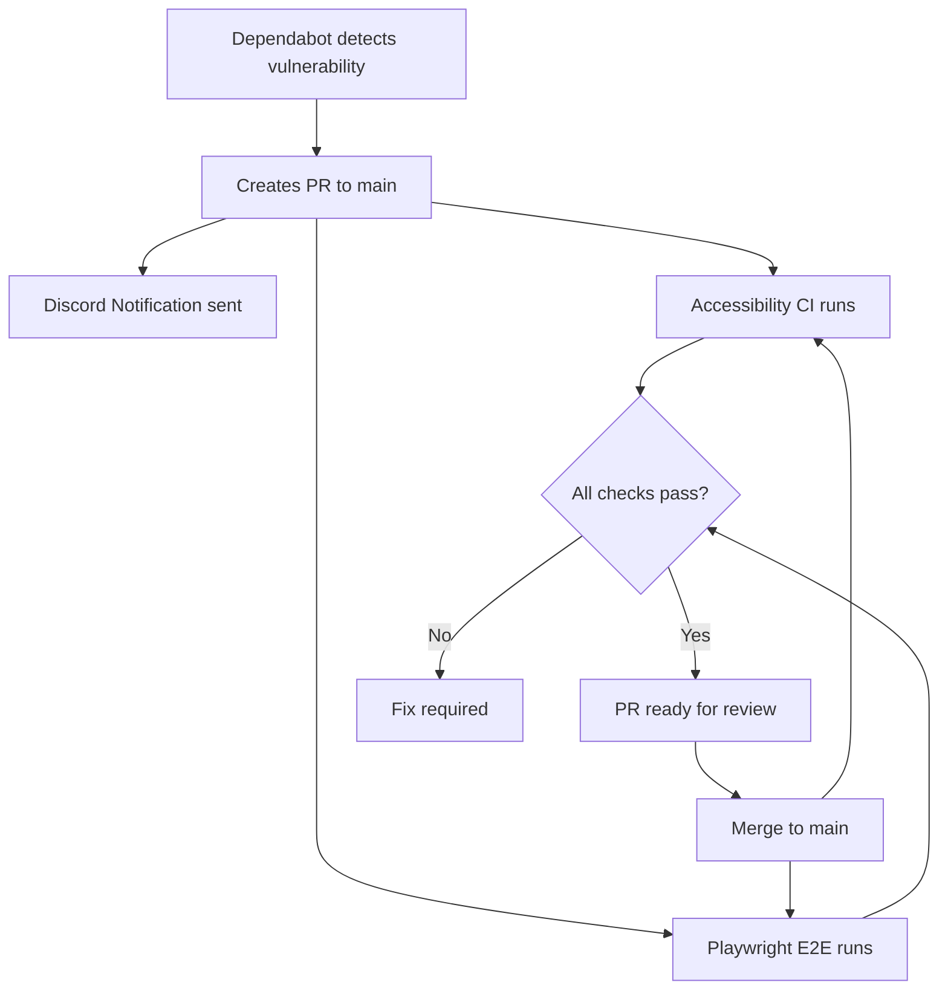

# Story 8.7: Create Project Documentation

Status: review

<!-- Note: Validation is optional. Run validate-create-story for quality check before dev-story. -->

## Story

As a **developer or portfolio viewer**,
I want **comprehensive project documentation with architecture diagrams**,
So that **the project is easy to understand and maintain**.

## Acceptance Criteria

1. **Given** the project root
   **When** I create/update `README.md`
   **Then** it includes: project title and description
   **And** it includes: tech stack with badges (Next.js 15, Payload 3, shadcn/ui, Tailwind, TypeScript)
   **And** it includes: infrastructure stack (Cloudflare, Vercel, Postgres, Axiom)

2. **Given** the README architecture section
   **When** documenting system design
   **Then** a Mermaid diagram shows the request flow:
   ```
   Visitor -> Cloudflare CDN/DNS -> Vercel Edge -> Next.js App -> Payload CMS -> PostgreSQL
   ```
   **And** Axiom telemetry is shown as a side connection from Next.js

3. **Given** the README data model section
   **When** documenting collections
   **Then** a Mermaid diagram shows Payload collections and relationships
   **And** it includes: Hero (global), About (global), GitHubData (global)
   **And** it includes: Projects, Skills, Experiences, Education, ContactSubmissions, SocialLinks
   **And** it shows which are globals vs collections

4. **Given** local development documentation
   **When** documenting setup steps
   **Then** it includes: prerequisites (Node.js 20+, pnpm 9+, PostgreSQL 16+)
   **And** it includes: environment variable setup (with reference to `.env.example`)
   **And** it includes: installation commands (`pnpm install`)
   **And** it includes: database setup and migration commands (`npx payload migrate`)
   **And** it includes: development server command (`pnpm dev`)

5. **Given** CI/CD documentation
   **When** documenting pipelines
   **Then** it describes: Accessibility CI workflow (Lighthouse, sitemap/robots validation)
   **And** it describes: E2E test workflow (Playwright)
   **And** it describes: Discord PR notifications
   **And** it describes: Dependabot security updates
   **And** a Mermaid diagram shows the CI/CD flow

6. **Given** deployment documentation
   **When** documenting production setup
   **Then** it describes: Vercel deployment configuration
   **And** it describes: required environment variables (without values)
   **And** it describes: Cloudflare DNS setup overview
   **And** it describes: database provisioning (Vercel Postgres/Neon)

7. **Given** the branch protection section
   **When** documenting recommended settings
   **Then** it includes the rules from Story 8.3
   **And** notes current applicability status (ready to enable when repo goes public)
   **And** provides step-by-step GitHub UI instructions

## Tasks / Subtasks

- [x] Task 1: Create README structure (AC: #1)
  - [x] Add project title "ralton.dev"
  - [x] Add project description
  - [x] Add CI status badges (Accessibility CI, Playwright E2E)
  - [x] Add tech stack section with badges

- [x] Task 2: Create Architecture section (AC: #2)
  - [x] Add Mermaid diagram showing request flow
  - [x] Include Cloudflare -> Vercel -> Next.js -> Payload -> Postgres flow
  - [x] Show Axiom telemetry connection
  - [x] Add brief description of each component's role

- [x] Task 3: Create Data Model section (AC: #3)
  - [x] Add Mermaid ER diagram showing Payload collections
  - [x] Document globals: Hero, About, GitHubData
  - [x] Document collections: Projects, Skills, Experiences, Education, ContactSubmissions, SocialLinks, Media, Users
  - [x] Show relationships between collections

- [x] Task 4: Create Local Development section (AC: #4)
  - [x] Document prerequisites (Node.js 20+, pnpm 9+)
  - [x] Document environment setup with `.env.example` reference
  - [x] Document installation steps
  - [x] Document database migration
  - [x] Document dev server commands
  - [x] Reference CLAUDE.md for additional dev standards

- [x] Task 5: Create CI/CD section (AC: #5)
  - [x] Document Accessibility CI workflow
  - [x] Document Playwright E2E workflow
  - [x] Document Discord PR notifications
  - [x] Document Dependabot configuration
  - [x] Add Mermaid diagram showing CI/CD flow

- [x] Task 6: Create Deployment section (AC: #6)
  - [x] Document Vercel deployment process
  - [x] List all environment variables (without values)
  - [x] Document Cloudflare DNS setup
  - [x] Document database provisioning

- [x] Task 7: Create Branch Protection section (AC: #7)
  - [x] Copy/adapt content from Story 8.3
  - [x] Document recommended rules
  - [x] Add step-by-step setup instructions
  - [x] Note current applicability status

- [x] Task 8: Review and polish (All ACs)
  - [x] Verify all Mermaid diagrams render correctly
  - [x] Ensure consistent formatting
  - [x] Check all links work
  - [x] Run Prettier formatting

## Dev Notes

### Implementation Specification

This story creates comprehensive project documentation in README.md. The documentation serves two purposes:
1. **For developers:** Quick setup guide and architecture understanding
2. **For portfolio viewers:** Demonstration of professional documentation skills

### README Structure

**Target file:** `README.md` (project root)

```markdown
# ralton.dev

Personal portfolio website built with Next.js 15, Payload CMS 3, and Tailwind CSS.

[](workflow-url)
[](workflow-url)

## Tech Stack

[Technology badges and descriptions]

## Architecture

[Mermaid diagram and component descriptions]

## Data Model

[Mermaid ER diagram of Payload collections]

## Local Development

[Prerequisites, setup, commands]

## CI/CD

[Workflow descriptions and diagram]

## Deployment

[Production setup instructions]

## Branch Protection (Ready to Enable)

[Documentation from Story 8.3]

## License

[License information]
```

### Architecture Diagram (Mermaid)



### Data Model Diagram (Mermaid)



### CI/CD Flow Diagram



### Environment Variables Documentation

Document the following environment variables (from `.env.example`):

| Variable | Purpose | Required |
|----------|---------|----------|
| `DATABASE_URL` | PostgreSQL connection string (Neon/Vercel Postgres) | Yes |
| `PAYLOAD_SECRET` | Payload CMS encryption key | Yes |
| `PAYLOAD_PREVIEW_SECRET` | Preview mode security | Yes |
| `NEXT_PUBLIC_SERVER_URL` | Server URL for preview redirects | Yes |
| `NEXT_PUBLIC_SITE_URL` | Canonical URL for SEO | Yes |
| `RESEND_API_KEY` | Email notifications (contact form) | Yes (production) |
| `DISCORD_WEBHOOK_URL` | Discord notifications | Optional |
| `ADMIN_EMAIL` | Admin notification recipient | Optional |
| `GITHUB_TOKEN` | GitHub API access | Yes |
| `GITHUB_USERNAME` | GitHub username for activity | Yes |
| `AXIOM_TOKEN` | Axiom observability token | Optional |
| `AXIOM_DATASET` | Axiom dataset name | Optional |
| `CRON_SECRET` | Cron job authentication | Yes |
| `ADMIN_ALLOWED_IP` | IP allowlist for admin (Vercel only) | Yes (production) |

### Branch Protection Documentation (from Story 8.3)

Include the following content from the design document:

**Recommended Settings for `main` branch:**

| Setting | Value | Rationale |
|---------|-------|-----------|
| Require pull request reviews | 1 reviewer | Code quality gate |
| Dismiss stale PR approvals | Yes | Prevent bypass via new commits |
| Require status checks | Yes | Automated quality gates |
| Status checks required | `Lighthouse Accessibility Audit`, `Playwright E2E` | Comprehensive coverage |
| Require branches up to date | Yes | Prevent merge conflicts |
| Do not allow bypassing | Yes | Consistent enforcement |

**Step-by-step setup:**
1. Go to Settings -> Branches -> Add rule
2. Branch name pattern: `main`
3. Enable required settings
4. Add required status checks

**Note:** Branch protection is not enforceable on private repos with free GitHub tier.

### Dev Standards

See [CLAUDE.md](../../../../../CLAUDE.md) for accessibility patterns, naming conventions, and project structure.

**Key Standards for This Story:**

**File Naming:**
- README.md (uppercase, project root)

**Formatting:**
- Use consistent heading levels
- Keep Mermaid diagrams simple and readable
- Use tables for structured data
- Include code blocks with proper syntax highlighting

**Markdown Best Practices:**
- Use relative links for internal files
- Use shields.io for badges
- Keep lines under 100 characters where possible

### Project Structure Notes

**Files to create/modify:**
- `README.md` (project root) - create or overwrite

**Existing files to reference:**
- `.env.example` - for environment variable documentation
- `CLAUDE.md` - for dev standards (can be linked)
- `docs/branch-protection.md` - if created in Story 8.3

### Technical Requirements

**Mermaid Diagrams:**
- GitHub natively renders Mermaid in markdown
- Test diagrams render correctly in GitHub preview
- Keep diagrams focused and not overly complex

**Badges:**
Use shields.io format:
```markdown
[](https://github.com/bralton/personal_website/actions/workflows/accessibility.yml)
```

**Links:**
- Internal links should be relative: `./CLAUDE.md`
- External links should use HTTPS

### Previous Story Intelligence

**From Story 8.1-8.6 (Epic 8):**
- All CI/CD workflows are now in place
- Discord notifications configured (pr-discord.yml)
- Dependabot configured (.github/dependabot.yml)
- Branch protection rules documented
- Custom 404 page implemented
- Admin IP allowlist middleware in place
- Playwright E2E tests configured

**From Epic 7 (Privacy):**
- Privacy policy page exists at /privacy
- Data collection practices documented

**Existing documentation:**
- CLAUDE.md covers dev standards, build commands, project structure
- .env.example lists all environment variables

### Git Intelligence

**Recent commits:**
```
bb3d59a test(e2e): add Playwright E2E testing infrastructure
c853afc feat(security): add admin IP allowlist middleware
420047a feat(ui): add custom 404 page with ASCII art
912daea docs(security): add branch protection rules documentation
76b6420 ci(deps): configure Dependabot for security updates
```

**Commit conventions observed:**
- `docs(...)`: Documentation changes
- `feat(...)`: New features
- `test(...)`: Test-related changes
- `ci(...)`: CI/CD changes

**Suggested commit message for this story:**
```
docs: add comprehensive README with architecture diagrams

Create project documentation including:
- Tech stack badges and descriptions
- Architecture Mermaid diagram (Cloudflare -> Vercel -> Next.js flow)
- Data model diagram (Payload collections and relationships)
- Local development setup guide
- CI/CD workflow documentation
- Environment variables reference
- Branch protection recommendations
```

### Testing & Verification

**Local Verification:**
1. Preview README.md in VS Code or GitHub
2. Verify all Mermaid diagrams render correctly
3. Test all internal links work
4. Verify badge URLs are correct (may show "unknown" until pushed)

**GitHub Verification:**
1. Push changes and view README on GitHub
2. Verify Mermaid diagrams render
3. Verify badges show correct status
4. Test all links navigate correctly

### Risk Assessment

**Risk Level:** Low

**Rationale:**
- Documentation-only story, no code changes
- README.md is a standard file with no runtime impact
- Mermaid diagrams are natively supported by GitHub

**Potential Issues:**
- Badge URLs may need adjustment based on actual repository path
- Mermaid diagram complexity may affect rendering on some viewers

**Mitigation:**
- Test diagrams in GitHub preview before finalizing
- Keep diagrams simple and focused
- Provide alternative text descriptions for complex diagrams

### References

- [Source: _bmad-output/planning-artifacts/epics/epic-8-ci-devops-security-documentation.md#Story 8.7]
- [Source: _bmad-output/planning-artifacts/epic-8-design-document.md#Section 9]
- [Source: CLAUDE.md - Project structure and dev standards]
- [Source: .env.example - Environment variables]
- [Source: 8-3-add-branch-protection-rules-configuration.md - Branch protection documentation]
- [Reference: GitHub Mermaid Documentation](https://docs.github.com/en/get-started/writing-on-github/working-with-advanced-formatting/creating-diagrams)
- [Reference: Shields.io Badge Generator](https://shields.io/)

## Dev Agent Record

### Agent Model Used

Claude Opus 4.5 (claude-opus-4-5-20251101)

### Debug Log References

N/A - Documentation-only story with no code execution issues.

### Completion Notes List

- Created comprehensive README.md at project root with all required sections
- Added CI status badges for Accessibility CI and Playwright E2E workflows
- Added tech stack badges (Next.js 15, Payload 3, shadcn/ui, Tailwind CSS, TypeScript)
- Added infrastructure badges (Cloudflare, Vercel, PostgreSQL, Axiom)
- Created Architecture section with Mermaid diagram showing request flow (Visitor -> Cloudflare -> Vercel -> Next.js -> Payload -> PostgreSQL) with Axiom telemetry side connection
- Created Component Roles table describing each infrastructure component
- Created Data Model section with comprehensive Mermaid ER diagram showing all Payload collections and their fields
- Created Payload Collections & Globals reference table distinguishing globals from collections
- Created Local Development section with prerequisites (Node.js 20+, pnpm 9+, PostgreSQL 16+)
- Documented installation steps with git clone and pnpm install commands
- Documented environment setup referencing .env.example
- Documented database migration command (npx payload migrate)
- Documented all development commands in a table format
- Added reference to CLAUDE.md for additional dev standards
- Created CI/CD section with Mermaid diagram showing workflow flow
- Documented all four workflows: Accessibility CI, Playwright E2E, PR Discord, Dependabot
- Added detailed descriptions for Accessibility CI and Playwright E2E workflows
- Created Deployment section with Vercel, Cloudflare DNS, and database provisioning documentation
- Created comprehensive Environment Variables table (13 variables without values)
- Created Branch Protection section adapted from Story 8.3 documentation
- Added recommended settings table and step-by-step setup instructions
- Linked to detailed docs/branch-protection.md for full instructions
- Ran Prettier formatting on README.md
- Verified all internal links work (CLAUDE.md, .env.example, docs/branch-protection.md all exist)
- Note: ESLint (pnpm lint) has a pre-existing configuration issue unrelated to this story

### File List

- README.md (NEW)

### Change Log

- 2026-03-11: Created comprehensive project documentation (Story 8.7)
