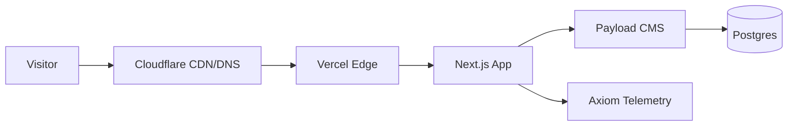

# Epic 8: CI/DevOps, Security & Documentation

Establish automated CI pipelines, security hardening, and comprehensive project documentation. This sprint focuses on operational excellence - reducing manual toil, tightening security, and ensuring the project is well-documented for future maintenance and portfolio presentation.

**Architecture Note:** The site uses Cloudflare (DNS/CDN) → Vercel (Edge/Compute) → Next.js → Payload → Postgres. IP detection must use `CF-Connecting-IP` header.

## Story 8.1: Configure Discord PR Notifications

As a **developer**,
I want **Discord notifications when PRs are opened**,
So that **I'm immediately aware of new pull requests without checking GitHub**.

**Acceptance Criteria:**

**Given** the GitHub repository
**When** I create `.github/workflows/pr-discord.yml`
**Then** it triggers on `pull_request: [opened]` events

**Given** a new PR is opened
**When** the workflow runs
**Then** a Discord webhook notification is sent
**And** the notification includes: PR title, description (truncated to 3900 chars), author, repository, and PR URL

**Given** the Discord webhook configuration
**When** setting up the workflow
**Then** the webhook URL is stored in `DISCORD_WEBHOOK_URL` GitHub secret
**And** the workflow validates the webhook URL format before sending
**And** the workflow uses `jq` for safe JSON payload construction

**Given** the webhook call fails
**When** Discord returns a non-200/204 status
**Then** the workflow fails with a clear error message
**And** the response body is logged for debugging

**Reference:** Use template from `kallion-mylab/.github/workflows/pr-discord.yml`

## Story 8.2: Enable Dependabot Security Updates

As a **developer**,
I want **automated dependency security updates**,
So that **vulnerabilities are caught and patched automatically**.

**Acceptance Criteria:**

**Given** the GitHub repository
**When** I create `.github/dependabot.yml`
**Then** Dependabot is configured for npm package ecosystem

**Given** Dependabot configuration
**When** setting update parameters
**Then** security updates are enabled
**And** PRs target the `main` branch
**And** update schedule is set to daily or weekly
**And** PR limit is configured to avoid overwhelming the repo

**Given** a security vulnerability is detected
**When** Dependabot identifies a fix
**Then** an automated PR is created to main
**And** the PR includes vulnerability details and fix description

**Given** Dependabot PRs
**When** they are created
**Then** they trigger existing CI workflows (Lighthouse, E2E when added)
**And** Discord notification is sent (via 8.1 workflow)

## Story 8.3: Add Branch Protection Rules Configuration

As a **developer**,
I want **branch protection rules documented and ready**,
So that **they can be enabled when the repo goes public or on a paid GitHub plan**.

**Acceptance Criteria:**

**Given** the project documentation
**When** I document branch protection settings
**Then** recommended rules are specified in README or docs

**Given** recommended branch protection for `main`
**When** documenting the configuration
**Then** it specifies: require PR reviews (1 reviewer)
**And** require status checks to pass (Lighthouse CI, E2E tests)
**And** require branches to be up to date before merging
**And** do not allow bypassing the above settings

**Given** the repository is currently private on free tier
**When** branch protection is not yet enforceable
**Then** the documentation notes this as "ready to enable"
**And** provides step-by-step GitHub UI instructions

## Story 8.4: Create Custom 404 Page

As a **visitor**,
I want **a creative, memorable 404 page**,
So that **even error states reflect the site's personality and professionalism**.

**Acceptance Criteria:**

**Given** the frontend application
**When** I create a custom 404 page
**Then** it has a creative, memorable design inspired by sites like GitHub, Reddit, and PostHog
**And** it maintains consistent branding with the rest of the site (fonts, colors, spacing)

**Given** the 404 page design
**When** a visitor lands on a non-existent page
**Then** the page clearly communicates that the requested content doesn't exist
**And** it provides helpful navigation options (link to homepage, main sections)
**And** it includes a subtle, personality-driven visual element or message

**Given** the security requirements from Story 8.5
**When** blocked admin access attempts occur
**Then** the same 404 page is displayed (security through obscurity)
**And** visitors cannot distinguish between a genuine 404 and a blocked admin route

**Given** accessibility requirements
**When** the 404 page is rendered
**Then** all text meets WCAG AA contrast requirements
**And** interactive elements have proper focus states
**And** the page is navigable via keyboard
**And** appropriate heading hierarchy is maintained

**Given** responsive design requirements
**When** the 404 page is viewed on different devices
**Then** it displays correctly on mobile, tablet, and desktop
**And** images/illustrations scale appropriately
**And** text remains readable at all breakpoints

## Story 8.5: Implement Admin IP Allowlist

As **Ben (admin)**,
I want **the `/admin` route restricted to my dedicated IP address**,
So that **unauthorized access to the CMS is blocked at the edge**.

**Acceptance Criteria:**

**Given** Vercel Edge Middleware
**When** I create/update `middleware.ts`
**Then** requests to `/admin` and `/admin/*` paths are intercepted

**Given** the Cloudflare → Vercel architecture
**When** extracting the client IP
**Then** the `CF-Connecting-IP` header is checked first
**And** fallback to `x-forwarded-for` header (first IP in list)
**And** fallback to `x-real-ip` if others unavailable

**Given** the allowed IP configuration
**When** setting up the allowlist
**Then** the allowed IP is stored in `ADMIN_ALLOWED_IP` environment variable
**And** the variable is set in Vercel project settings (not committed to repo)

**Given** a request to `/admin` from an allowed IP
**When** the middleware checks the IP
**Then** the request proceeds to the Next.js app normally

**Given** a request to `/admin` from a disallowed IP
**When** the middleware checks the IP
**Then** a 404 Not Found response is returned (not 403 Forbidden)
**And** the custom 404 page from Story 8.4 is displayed
**And** the response does not reveal that `/admin` exists (security through obscurity)
**And** the blocked attempt is logged server-side (IP, timestamp, path)

**Given** the middleware configuration
**When** matching paths
**Then** only `/admin` routes are protected
**And** all other routes (homepage, API, etc.) are unaffected

## Story 8.6: Set Up Playwright E2E Tests

As a **developer**,
I want **automated E2E tests running on every PR**,
So that **critical user paths are verified before merging**.

**Acceptance Criteria:**

**Given** the project dependencies
**When** I set up Playwright
**Then** `@playwright/test` is installed as a dev dependency
**And** `playwright.config.ts` is created with sensible defaults
**And** `pnpm test:e2e` script is added to package.json

**Given** the test suite
**When** I create E2E tests
**Then** tests cover: homepage renders all sections (Hero, About, Experience, Education, Projects, Skills)
**And** tests cover: navigation works (smooth scroll, mobile menu toggle)
**And** tests cover: contact form submission flow (validation, success state)
**And** tests cover: social links are visible and clickable

**Given** the GitHub Actions workflow
**When** I create `.github/workflows/e2e.yml`
**Then** it triggers on pull_request to main
**And** it sets up a Postgres service container
**And** it builds the app and runs migrations
**And** it seeds test data (using existing `scripts/seed-ci.ts`)
**And** it runs Playwright tests against the built app

**Given** test results
**When** tests complete
**Then** test artifacts (screenshots, traces on failure) are uploaded
**And** workflow status is reported to PR checks

**Given** test file organization
**When** structuring the test suite
**Then** tests are placed in `e2e/` or `tests/` directory
**And** tests are organized by feature (homepage.spec.ts, contact.spec.ts, etc.)

## Story 8.7: Create Project Documentation

As a **developer or portfolio viewer**,
I want **comprehensive project documentation with architecture diagrams**,
So that **the project is easy to understand and maintain**.

**Acceptance Criteria:**

**Given** the project root
**When** I create `README.md`
**Then** it includes: project title and description
**And** it includes: tech stack with badges (Next.js 16, Payload 3, shadcn/ui, Tailwind, TypeScript)
**And** it includes: infrastructure stack (Cloudflare, Vercel, Postgres, Axiom)

**Given** the README architecture section
**When** documenting system design
**Then** a Mermaid diagram shows the request flow:

**Given** the README data model section
**When** documenting collections
**Then** a Mermaid diagram shows Payload collections and relationships

**Given** local development documentation
**When** documenting setup steps
**Then** it includes: prerequisites (Node.js, pnpm)
**And** it includes: environment variable setup (with example `.env.example`)
**And** it includes: installation commands (`pnpm install`)
**And** it includes: database setup and migration commands
**And** it includes: development server command (`pnpm dev`)

**Given** CI/CD documentation
**When** documenting pipelines
**Then** it describes: Lighthouse CI workflow (accessibility, performance)
**And** it describes: E2E test workflow (Playwright)
**And** it describes: Discord PR notifications
**And** it describes: Dependabot security updates
**And** a Mermaid diagram shows the CI/CD flow

**Given** deployment documentation
**When** documenting production setup
**Then** it describes: Vercel deployment configuration
**And** it describes: required environment variables (without values)
**And** it describes: Cloudflare DNS setup
**And** it describes: database provisioning (Vercel Postgres)

**Given** the branch protection section
**When** documenting recommended settings
**Then** it includes the rules from Story 8.3
**And** notes current applicability status

---
