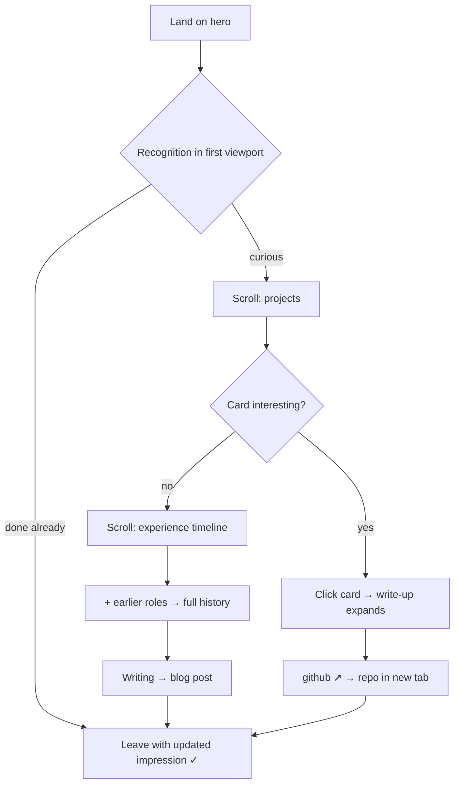
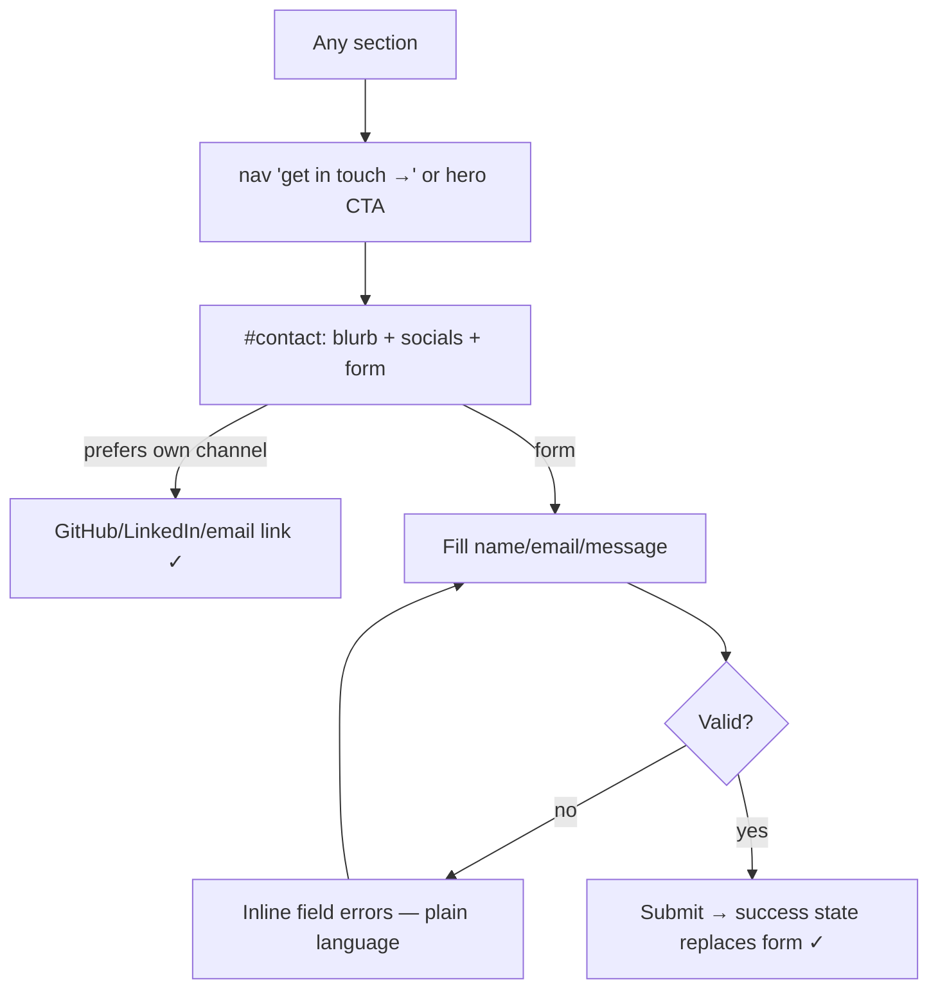

# UX Design Specification personal_website — Frontend Redesign (v2)

**Author:** Ben
**Date:** 2026-07-21

---

<!-- UX design content will be appended sequentially through collaborative workflow steps -->

## Executive Summary

### Project Vision

A **frontend-only redesign** of ralton.dev, Ben's personal portfolio site. The existing Next.js + Payload CMS backend, all collections, globals, and admin workflows are retained unchanged — this revision re-lays-out the same data. The v1 design (nine uniformly-padded, single-column sections) reads as sparse and clunky, with an 85vh hero holding four lines of text and section content occupying islands in empty dark space. The redesign compresses the site into five dense, two-column sections with a working hero, an infrastructure-manifest visual language (`~/section` mono labels, terminal prompt accents), and teal promoted to a systematic accent. Direction validated via approved interactive mockup (`redesign-mockup-approved.html`).

### Target Users

**Revised from v1.** The v1 spec optimized for recruiters making seconds-long assessments. This revision reorients:

- **Primary: Ben's professional network** — peers, former colleagues, collaborators arriving via LinkedIn/GitHub/word of mouth. They're browsing with curiosity, not screening; the site should reward a visit with personality and substance.
- **Primary: Ben himself** — the site is a personal artifact he should enjoy owning and maintaining via Payload.
- **Secondary: recruiters/clients** — still served (density and scannability help them too), but no longer the design's center of gravity.

### Key Design Challenges

1. **Wasted-space elimination** — every section must earn its vertical footprint; no half-empty bands on a dark ground (dark backgrounds make emptiness read heavier).
2. **Density without clutter** — folding 9 sections into 5 (About→Hero, Skills+Education→Experience sidebar) while keeping each element scannable.
3. **Progressive disclosure** — long-form content (project write-ups, older roles) stays available but collapsed; cards tease, clicks reveal.
4. **CMS-shape fidelity** — every layout element must map 1:1 to existing Payload globals/collections; the design cannot demand schema changes.
5. **Personality with restraint** — terminal flavour (`$ whoami`, `uptime: excellent`) as seasoning, not theme-park.

### Design Opportunities

- **The hero as proof panel** — GitHub contribution graph + stat chips above the fold turns the site's most distinctive data into the first impression.
- **Teal as a system** — section labels, timeline markers, status badges, and the contribution graph in one accent family gives the site an identity v1's tag-outlines never did.
- **Status vocabulary** — project badges (*active / archived · MVP*) and current-role timeline dots borrow honest DevOps semantics that Ben's network will read fluently.

## Core User Experience

### Defining Experience

**"Land, get it, wander."** A network visitor arrives (usually from LinkedIn or GitHub) and within one viewport understands who Ben is, what he does, and that he's *active* — the hero pitch plus live GitHub proof panel does this without a single scroll. Everything after that is optional wandering that keeps rewarding: expandable project stories, a scannable career timeline, recent writing. The core loop is not conversion; it's **recognition** — "yep, that's Ben, and this is sharp."

### Platform Strategy

- **Web only**, responsive — desktop-first composition (two-column grids) that collapses gracefully to a single column on mobile (~900px breakpoint).
- Mouse/keyboard and touch both first-class: expand/collapse targets are whole cards, minimum 44px interactive targets retained from v1 standards.
- Rendering stays **Next.js server components** fetching from Payload at build/revalidate time — no client data fetching introduced; interactivity (expanders, toasts) is progressive enhancement over semantic HTML (`
`).
- No offline requirements.

### Effortless Interactions

- **Zero-scroll comprehension**: identity, role, pitch, skills, and proof visible in the first viewport on desktop.
- **Whole-card expansion**: project cards toggle their full write-up on click anywhere (links excepted, text-selection safe) — no hunting for a small control.
- **One-click depth**: older roles behind a single "+ earlier roles" expander; no pagination, no separate page.
- **Anchor navigation**: 4-item nav (Projects, Experience, Writing, get in touch) with smooth scroll; reduced-motion respected.

### Critical Success Moments

1. **First viewport** — if the hero reads as sparse or generic, the redesign has failed its founding premise. The proof panel must render with real data (graceful fallback if GitHubData is stale: hide the panel's graph, keep stats).
2. **First card click** — the expand must feel instant and settle without layout jank; this teaches "the site rewards poking at things."
3. **Ben's own returning visit** — adding a role/project in Payload must slot into the new layout with zero code changes and look right immediately.

### Experience Principles

1. **Every band earns its height** — no section may render taller than its content justifies; spacing rhythm is owned by the section system, not per-component margins.
2. **Tease, then reveal** — summaries visible, depth one interaction away, nothing lost from v1's content.
3. **Data is the decoration** — the contribution graph, status badges, and timeline states are the visual interest; no ornamental graphics that don't encode something true.
4. **The CMS is the contract** — if a design element can't be expressed with existing Payload fields, the design element changes, not the schema.

## Desired Emotional Response

### Primary Emotional Goals

- **Recognition, not persuasion** — visitors who know Ben should think "this is exactly him": technically sharp, no fluff, a dry wink. The site's personality should feel like his, not a template's.
- **Quiet competence** — the density, the honest status badges, the real contribution data all signal "this person ships" without a single boast.
- **Pride of ownership (Ben)** — opening the site should feel satisfying, not embarrassing; adding content in Payload should feel like maintaining a well-kept tool.

### Emotional Journey Mapping

- **Arrival** → instant orientation, mild delight at the proof panel ("oh, live GitHub data").
- **Wandering** → small rewards for curiosity: cards that open, an expander that reveals more history, a footer joke found only by scrolling all the way.
- **Leaving** → the takeaway is a feeling, not a fact sheet: *Ben's doing well and doing interesting things.*
- **If something's missing** (no posts yet, stale GitHub data) → sections degrade silently — collapse or hide rather than showing empty states that apologize.

### Micro-Emotions

- **Confidence over confusion** — the critical pair. Every interactive element looks interactive; nothing that looks interactive is dead.
- **Delight over satisfaction** — seasoning-level: the `$ whoami` prompt, `uptime: excellent`, status badges. Never at the cost of clarity.
- **Trust over skepticism** — honest data ("archived · MVP" on a dead project builds more trust than hiding it).

### Design Implications

- Recognition → terminal vernacular and DevOps status semantics as the voice; copy in first person, plain, a little dry.
- Quiet competence → density and tabular data treatment (mono timestamps, tabular-nums stats); no superlatives in copy.
- Confidence → whole-card click targets, visible `+`/`−` affordances, focus rings, no dead links in production.
- Silent degradation → every CMS-driven block defines its empty/stale behavior in the component spec (later step).

### Emotional Design Principles

1. **Self-deprecating honesty beats polish** — keeping "(Abandoned)" energy, formalized as status badges.
2. **Wit lives in the margins** — prompts, badges, footer; never in headings or body copy.
3. **Nothing performs enthusiasm** — the data does the talking.

## UX Pattern Analysis & Inspiration

### Inspiring Products Analysis

- **GitHub profile pages** — the model for "data as identity." The contribution graph is proof-of-work rendered as texture; pinned repos are curation over exhaustiveness. Our proof panel and 2-project focus adapt both directly.
- **Terminal/TUI tools (htop, k9s, lazygit)** — the aesthetic vocabulary of Ben's actual workday: mono type, dense tabular layouts, status glyphs, color used semantically not decoratively. Source of the `~/section` labels, `$ whoami` prompt, and status badges.
- **Linear (linear.app)** — the benchmark for restrained dark UI: blue-biased dark grounds (never pure black), one disciplined accent, panel borders over drop shadows, micro-interactions that settle instantly. Our palette strategy follows this school.
- **Vercel/modern developer-tool landing pages** — asymmetric two-column heroes where one side is narrative and the other is live product evidence; density as a credibility signal.

### Transferable UX Patterns

- **Proof-over-claim hero** (GitHub/Vercel) → hero right column is real activity data, not illustration.
- **Curation with an escape hatch** (GitHub pinned repos) → 4 recent roles visible, the rest one expander away.
- **Semantic status color** (TUI tools) → teal = active/current; muted = archived/past. Color always means something.
- **Panel-and-border depth** (Linear) → hierarchy via border color shifts on hover, not shadows or scale transforms.

### Anti-Patterns to Avoid

- **The v1 site itself is the primary anti-pattern**: ceremonial single-column sections, equal visual weight for unequal content, hero-as-void, accent color present but not systematic.
- **Terminal cosplay** — full fake-terminal portfolios (typing animations, blinking cursors, `cd about/`) sacrifice usability for theme; we take the vocabulary, not the costume.
- **Scroll-hijacking and entrance animations** on portfolio sites — motion that delays content on repeat visits; our motion budget is hover states and expand transitions only.
- **Skill percentage bars** — pseudo-data (what is "80% Docker"?); violates the "data is the decoration" principle. Skill tags carry context instead.

### Design Inspiration Strategy

**Adopt:** GitHub's proof-panel concept; Linear's dark-ground discipline; TUI status semantics.
**Adapt:** Bento-density ideas into a *sectioned* page (not a full bento grid — the content is narrative enough to deserve reading order).
**Avoid:** Terminal theatrics, motion-heavy reveals, decorative pseudo-data.

## Design System Foundation

### Design System Choice

**Retain the existing stack: Tailwind CSS + shadcn/ui primitives, re-themed.** The redesign is expressed entirely through a revised token layer (CSS variables in `globals.css` + Tailwind config) and new/reworked section components. No new UI library is introduced.

### Rationale for Selection

- **It's already there and proven** — shadcn/ui components (`button`, `card`, form inputs) are in `src/components/ui/` and carry the accessibility work (focus states, ARIA) from v1; the redesign restyles rather than replaces them.
- **Token-driven restyling matches the scope** — the mockup's entire visual shift (blue-biased dark ground, panel/border hierarchy, teal system) is expressible as CSS variable values, which is precisely Tailwind + shadcn's theming model.
- **Zero migration risk** — the contact form, admin styles, and blog components keep working; unchanged components simply inherit the new tokens.
- **Prettier + `prettier-plugin-tailwindcss` conventions carry over** — no new formatting or naming standards for future work.

### Implementation Approach

- **Design tokens** (defined next step) land as CSS custom properties on `:root` in `globals.css`, replacing v1's values — components reference tokens, never raw hexes.
- **New composite components** built from existing primitives: `ProofPanel`, `SectionHeader` (the `~/label` + rule), `TimelineItem`, `StatusBadge`, expandable `ProjectCard`. Native `
`/`
` where possible, styled with Tailwind.
- **Deletions are part of the system**: `AboutSection`, `SkillsSection`, `EducationSection`, `GitHubGraph` (as standalone band) retire as top-level sections; their render logic folds into Hero and Experience composites. Payload collections behind them are untouched.
- **CSS discipline note for implementation**: v1's uniform `py-16 md:py-24` per-section padding is replaced by a single section-rhythm owner (shared section wrapper), avoiding the specificity/rhythm drift that caused the mockup's spacing bug.

## Defining Experience

### The Defining Experience

**"One viewport, whole story."** The redesign lives or dies on the first screenful: name, role, a four-line pitch that actually says something, six core-skill chips, and a live proof panel — a visitor understands *who, what, and how active* before touching the scrollbar. If someone described the site to a friend, they'd say: *"his homepage shows his actual GitHub activity next to his intro — the whole thing feels like a well-run dashboard."*

### User Mental Model

Network visitors arrive with a **profile-page mental model** (LinkedIn, GitHub): expect identity at top, evidence below, details on demand. The redesign honors that ordering but compresses it — evidence moves *up* into the first viewport instead of living nine scrolls down. The terminal vocabulary (`$ whoami`, `~/projects`) maps to a developer audience's daily environment, so it reads as vernacular, not gimmick. No user education needed anywhere: anchors scroll, cards expand, forms submit — every pattern is established; the innovation is in composition and density, not interaction novelty.

### Success Criteria

- **Zero-scroll comprehension** on a 1440×900 desktop viewport: identity, pitch, skills, proof, both CTAs all visible.
- **Sub-second recognition of activity**: contribution graph renders with the page (server-rendered from GitHubData global — no loading spinner, no layout shift).
- **The scroll feels short**: full homepage ≤ ~4 viewports on desktop (v1 is ~10).
- **Poking is rewarded**: first card click expands instantly (<150ms perceived), teaching the site's depth-on-demand behavior.

### Experience Mechanics — hero proof panel & card expansion

1. **Initiation** — none required; the hero is the landing state. Card expansion invites via hover (border shifts to teal) and the visible `+ full write-up` affordance.
2. **Interaction** — click/tap anywhere on a project card toggles its write-up; `+ earlier roles` reveals deeper history; anchor nav jumps between the five sections.
3. **Feedback** — expand animates open smoothly (height transition, reduced-motion: instant); toggle glyph flips `+`→`−`; hover states on all interactive surfaces; focus rings for keyboard.
4. **Completion** — there is no "done": success is the visitor leaving with the recognition feeling, or clicking through to GitHub/a blog post/the contact form. Contact submission keeps v1's flow (validation, success state) restyled to the new tokens.

## Visual Design Foundation

### Color System

The approved mockup's palette, verbatim. All values become CSS custom properties; components never use raw hexes.

| Token | Value | Role |
|---|---|---|
| `--bg` | `#0B0F14` | Page ground — blue-biased near-black (never pure `#000`) |
| `--panel` | `#10161D` | Card/panel surfaces |
| `--panel-2` | `#141C25` | Raised surfaces (thumbnails, hover fills, toast) |
| `--border` | `#1E2937` | Default panel borders |
| `--border-soft` | `#182230` | Hairlines: section rules, dividers, inner separators |
| `--text` | `#E6EDF3` | Primary text |
| `--text-2` | `#94A6B8` | Secondary text (body prose, descriptions) |
| `--text-3` | `#5D7288` | Tertiary (metadata, labels, mono annotations) |
| `--teal` | `#2DD4BF` | Bright accent: section labels, links, active states, graph peaks |
| `--teal-dim` | `#14B8A6` | Primary button fill, tag text |
| `--teal-deep` | `#0F766E` | Hover borders, outlines, subdued accent |
| `--teal-ink` | `#042F2E` | Accent-tinted fills (timeline dot cores) |

**Semantic rules:** teal = *alive* (current role, active project, interactive); muted greys = *past/inert*. Primary buttons are `--teal-dim` fill with dark text `#04201D` (WCAG AA large-text safe); v1's `teal-600`-contrast prohibition carries forward — bright teal never appears as text on panels below 14px without the mono treatment. Semantic form colors (error red on required fields) stay separate from the accent family.

### Typography System

- **Inter** (existing) — all reading text. Weights: 800 display (name), 700 headings/card titles, 650/600 sub-heads, 400 body.
- **JetBrains Mono** (existing) — the *voice* face: `~/section` labels, `$ whoami`, dates, tags, stats labels, badges, footer. Mono is never used for reading prose.
- Scale (desktop): display `clamp(34→46px)`; section label 13px mono; card title 17px; body 15px/1.6; small body 13.5px; meta/mono 11–12.5px with `letter-spacing: 0.06em` on uppercase labels.
- Numbers in stats use `font-variant-numeric: tabular-nums`.

### Spacing & Layout Foundation

- **Container:** max-width **1120px** (down from v1's 1200px — narrower reads denser), 24px side padding.
- **Section rhythm:** ~96px above each section header, ~16px below section content; owned by a single shared `Section` wrapper component — **never** per-component vertical margins (documented lesson from the mockup's specificity bug).
- **Grids:** hero `1.15fr / 1fr`; experience `1.5fr / 1fr`; contact `1fr / 1.2fr`; projects `1fr / 1fr`; posts 3-up. All collapse to one column below 900px.
- **Radii:** 12px panels/cards, 8px buttons/inputs, 4px chips, 2px graph cells. **No drop shadows** — depth is border-color change only.

### Accessibility Considerations

- Contrast: all text tokens ≥ 4.5:1 on their grounds (`--text-2` on `--panel` ≈ 7:1; `--text-3` reserved for ≥11px mono metadata, ≥ 4.5:1 on `--bg`).
- Focus: 2px `--teal` ring, 2px offset, on every interactive element (carried from v1 standard).
- `prefers-reduced-motion`: all transitions/smooth-scroll drop to instant.
- Expanders are native `
/
` — keyboard and screen-reader semantics for free; whole-card click is enhancement on top.
- Lighthouse accessibility CI gate (existing workflow) must stay green — the redesign is not allowed to regress it.

## Design Direction Decision

### Design Directions Explored

Three directions were evaluated against the "wasted space / clunky" diagnosis of v1:

1. **Compress & densify** — keep the linear one-pager, tighten padding, merge sections, add two-column layouts.
2. **Bento/dashboard grid** — hero + varied-size card grid above the fold; maximum density, minimum narrative.
3. **Multi-page split** — punchy landing page with best content; Experience/Education/Blog on separate routes.

An interactive HTML mockup was built for the chosen direction and refined through three feedback rounds with Ben (screenshot-driven). Final approved version: `redesign-mockup-approved.html` (also the live artifact used during review).

### Chosen Direction

**Direction 1 compressed further with Direction 2's hero** — a five-section single page ("land, get it, wander") whose hero borrows the bento instinct: a two-column split with a data panel. Full composition:

- **Nav**: logo + wordmark left; Projects / Experience / Writing / `get in touch →` (mono, teal outline) right. Sticky, blur backdrop.
- **Hero** (~60vh): avatar + `$ whoami` + name + role + 4-line pitch + 6 skill chips + 2 CTAs ⟂ proof panel (contribution graph + 3 stats).
- **`~/projects`**: 2-up card grid; thumbnail, title + status badge, one-sentence summary, tags, github link, whole-card-click expandable write-up.
- **`~/experience`**: timeline (teal dots for current roles, 4 most recent visible, `+ earlier roles` expander) ⟂ sidebar (Education & certs list + "toolbox" — 6 label-prefixed skill lines).
- **`~/writing`**: 3 latest posts from Payload.
- **`~/contact`**: blurb + social links ⟂ form (name/email row, message, submit).
- **Footer**: hairline, copyright, `uptime: excellent`.

### Design Rationale

- Kills the diagnosed failures directly: no empty right halves, no ceremonial equal-weight sections, hero carries payload instead of void.
- Single page preserved — the content volume doesn't justify routes, and network visitors browse rather than navigate.
- Iteration rounds validated the interaction details users actually hit: divider rhythm, expander alignment, whole-card click targets, logo presence.

### Implementation Approach

The approved mockup is the **visual source of truth** for implementation. Components are specced (step 11) by mapping mockup regions → React components → existing Payload data. Where the mockup and this spec disagree, the spec wins; where the spec is silent, match the mockup pixel-for-pixel.

## User Journey Flows

### Journey 1 — Network visitor: "Who's Ben these days?"

Entry: LinkedIn/GitHub profile link, or word of mouth. Device: 50/50 desktop/mobile.

Optimizations: no interaction is required to "succeed" — the pure-scroll path delivers the whole story; expansions are bonuses. External links (GitHub, socials) open in new tabs so the wander isn't terminated by curiosity.

### Journey 2 — Reader: arrives at a blog post directly

Entry: shared link to `/blog/[slug]` — this journey never touches the homepage, so the redesign extends to blog routes (in scope, confirmed) or the site feels like two different products.

Treatment: blog index and post pages adopt the new tokens, nav, and `~/writing` header style; post layout stays a single reading column (65ch) — density rules don't apply to long-form reading. Post footer gains a compact "more posts" row plus a one-line author card (avatar, `$ whoami` pitch line, link home) — turning every shared post into a soft homepage entry.

### Journey 3 — Visitor decides to reach out

Unchanged mechanics from v1 (validation, ContactSubmissions, notifications) — restyled only. Success state gets the new voice: confirmation in mono, e.g. `message queued — I'll reply soon`.

### Journey 4 — Ben maintains the site

Payload admin flow untouched. The layout contract: new roles/projects/posts/skills slot into the new components with zero code changes; visibility toggles keep working; section-level empty states (no posts → `~/writing` hides entirely) mean a half-empty CMS never produces a broken-looking page.

### Journey Patterns

- **Feedback**: hover = border shift; active/current = teal; expansion = `+`/`−` glyph flip.
- **Progressive disclosure**: one consistent expander pattern everywhere (projects, roles).
- **Escape hatches**: every dead end offers a next step (post footer → more posts; empty sections → hidden, not apologetic).

## Component Strategy

### Design System Components (existing, re-themed only)

`Button`, `Input`/`Textarea`/form primitives, `Card` shell, `Navigation` (structure kept, links reduced), `ContactForm` (logic untouched), `Pagination`, `CodeBlock`, `BlogPostCard` (restyled to `PostCard` treatment).

### Custom Components

**`Section`** — the rhythm owner. Renders `<section id>` + `SectionHeader` + children with the canonical spacing (`pt-24 pb-4` equivalent tokens). *All five homepage sections and blog index use it; no section may set its own vertical padding.* Props: `label`, `meta?`, `id`.

**`SectionHeader`** — mono `~/label` (teal, `~/` prefix in `--text-3`) + flex hairline rule + optional right-aligned mono meta slot. States: none (static). A11y: renders `<h2>` — heading semantics preserved.

**`HeroIntro`** — left hero column. Data: `Hero` global (name, headline, tagline→pitch, ctaButtons) + avatar from `Media`/About photo + top-N skills (from Skills, existing fields/order only; first 6 by existing sort order). Contains `$ whoami` prompt (static copy).

**`ProofPanel`** — hero right column. Data: `GitHubData` global (contribution calendar, total, profile URL). Anatomy: header (mono repo-style title + `view →` link), contribution grid (26 weeks desktop / fewer columns under 640px, 5-shade teal scale, `aria-hidden` grid + text alternative "1,946 contributions in the last year"), stats row (contributions · years — derived from earliest experience date · cert label from Education). States: fresh (full), stale/missing GitHubData (grid hidden, stats remain), reduced data (grid fills available weeks). Server-rendered; zero CLS.

**`ProjectCard`** — expandable card. Data: `Projects` collection (title, status→badge, summary [first sentence or existing short field], full description→write-up, tags, github URL, thumbnail from Media with generated-SVG fallback slot). Anatomy: thumb / title+`StatusBadge` / one-liner / tags+repo link / `
` write-up. States: rest, hover (border→`--teal-deep`), expanded, focus. Interaction: whole-card click toggles (excluding links, respecting text selection — client component); `
` keyboard-operable. Grid: 2-up; 1-up mobile; if project count is odd/>2, grid wraps naturally.

**`StatusBadge`** — mono 10.5px chip. Variants: `active` (teal/`--teal-deep` border), `archived` (grey), driven by existing status/name conventions in Projects data.

**`Timeline` / `TimelineItem`** — Data: `Experiences` (title, company, dates, description). Anatomy: left rule + dot (teal ring for `current` — derived from empty end-date), head row (h3 + company), mono dates, ≤2-line description (existing text, no truncation logic — content discipline via CMS). Behavior: first 4 render open; remainder inside `EarlierRoles` (`
`, summary `+ earlier roles`, self-hides when ≤4 total). Dot alignment is anchored to the item header, not the container top (documented mockup bug).

**`ExperienceSidebar`** — `EduList` (Education collection → name/institution/mono year range rows) + `Toolbox` (Skills by category → six label-prefixed lines; category names map to short mono labels: cloud, iac / ops, ci/cd, code, data, people).

**`PostCard`** — Data: existing blog collection: date (mono), title, excerpt (~120 chars), `read →`. Used 3-up on homepage (`LatestPostsSection` refactor) and in blog index.

**`ContactSplit`** — blurb + `SocialLinks` (existing collection) ⟂ restyled `ContactForm`. Form success state: mono confirmation line replacing form.

**`AuthorFooterCard`** (blog posts) — avatar + one-line pitch + home link + "more posts" row.

### Component Implementation Strategy

- **Phase 1 (core):** tokens in `globals.css` → `Section`/`SectionHeader` → `HeroIntro` + `ProofPanel` → homepage assembly with placeholder sections.
- **Phase 2:** `ProjectCard`+`StatusBadge`, `Timeline`+`ExperienceSidebar`, `PostCard`, `ContactSplit`, footer.
- **Phase 3 (blog):** blog index + post pages re-themed, `AuthorFooterCard`, delete retired components (`AboutSection`, `SkillsSection`, `EducationSection`, standalone `GitHubGraph`).
- Client-side JS is limited to: card-click toggling, nav mobile behavior. Everything else is server components + native `
`.

## UX Consistency Patterns

### Buttons & Links

- **Primary button** (one per view region): `--teal-dim` fill, dark text, 8px radius — "Get in touch", "Send message". Hover: `--teal`.
- **Ghost button**: `--border` outline, `--text-2` — secondary actions ("See my work"). Hover: border/text lighten.
- **Mono-link**: JetBrains Mono, teal — data-adjacent actions (`view →`, `read →`, `github ↗`, `all posts →`). Hover: underline or color shift. Arrow glyphs signal destination: `→` internal, `↗` external (new tab, `rel="noopener"`).
- Never two primary buttons side by side; never a primary button inside a card.

### Feedback

- **Success**: inline, mono voice, teal (`message queued — I'll reply soon`). No toasts on the production site (mockup's toast was scaffolding).
- **Error**: plain-language inline field errors, semantic red, never mono (errors are reading text, not vernacular).
- **Hover**: border-color shift only — no scale, no shadow, no translate.
- **Focus**: 2px teal ring, 2px offset, universally.

### Forms

- Labels above fields, 12.5px, `--text-2`. Required marker: red asterisk (v1 carryover).
- Validation on submit + on blur after first error; error text below field.
- Submit disables during flight with mono `sending…` label; success replaces the form, with the social links remaining as the escape hatch.

### Expanders (the one disclosure pattern)

- Native `
/
`; summary always mono, teal, prefixed `+` (closed) / `−` (open).
- Labels name the payload, not the mechanism: `+ full write-up`, `+ earlier roles` — never "show more".
- Height transition ~200ms ease; instant under reduced motion. One expander pattern site-wide — no accordions, no modals anywhere on the site.

### Empty & Degraded States

- **Section-level**: a section with no data renders nothing at all (no header, no gap) — `~/writing` with zero posts simply doesn't exist.
- **Element-level**: missing optional data collapses silently (no thumbnail → text-only card top; stale GitHub → stats without grid).
- The site never apologizes, explains, or placeholders in production.

### Mono Vocabulary (usage contract)

Mono type is reserved for: section labels, prompts, dates/timestamps, tags/chips, badges, stats labels, form-flight/success states, footer. If it's a sentence a human reads for meaning, it's Inter. This boundary is what keeps the terminal flavour at seasoning level.

### Navigation

- Sticky, 56px, blur backdrop; logo+wordmark → home/top.
- Anchor links scroll smooth (instant under reduced motion); on blog pages the same nav items link back to `/#projects` etc.
- Mobile (<900px): plain links hide, `get in touch →` CTA persists — a hamburger is unnecessary for a 4-anchor single-pager; blog pages keep wordmark + CTA.

## Responsive Design & Accessibility

### Responsive Strategy

**Desktop (≥900px)** is the composition target: all two-column grids active, hero split fits 1440×900 without scroll, 1120px container centers on ultra-wide with balanced margins.

**Mobile/tablet (<900px)** stacks in reading order, preserving the information hierarchy rather than re-inventing it:

- Hero: intro column first, proof panel directly beneath (graph shrinks to available weeks — trailing ~6 months — rather than shrinking cells below legibility; stats row stays 3-up).
- Projects/posts: single column. Experience: timeline first, sidebar (education, toolbox) after. Contact: blurb then form.
- Density holds: section top spacing compresses ~96px→64px; type scale steps down only at the display level (`clamp` handles it).
- Touch: all targets ≥44px (cards, summaries, nav CTA); hover affordances have visible static equivalents (the `+` glyph, borders) so nothing is hover-discoverable only.

**Breakpoints:** one primary at **900px** plus Tailwind defaults where needed for minor adjustments (e.g., 640px for graph columns and form row stacking). Single-breakpoint discipline is deliberate — v1's four-way responsive padding (`px-4 md:px-6 lg:px-8`) added complexity without visible benefit.

### Accessibility Compliance — WCAG 2.1 AA

Carried from v1 as a hard floor, with redesign-specific attention:

- **Contrast**: token pairs pre-verified (step 8); the one watch-item is `--text-3` metadata on `--panel` — implementation must verify ≥4.5:1 or bump the token.
- **Keyboard**: full tab order top-to-bottom; expanders via `
` + Enter/Space; skip-to-content link retained from v1; focus ring universal.
- **Screen readers**: contribution grid `aria-hidden` with text alternative; `<ul role="list">` + `aria-label` conventions from v1 carry over on chips, tags, timeline, posts; sections keep proper `<h2>` headings (the mono `~/label` is styling, not a heading replacement); decorative SVG thumbnails `aria-hidden`.
- **Motion**: only transitions are border-color, expander height, smooth scroll — all disabled under `prefers-reduced-motion`.
- **Whole-card click** is enhancement only; the `
` element remains the accessible control.

### Testing Strategy

- **Existing CI stays the gate**: Lighthouse accessibility + sitemap/robots checks must pass; add the redesigned blog routes to the Lighthouse run if not already covered.
- **Manual pass before ship**: keyboard-only walkthrough, VoiceOver spot-check (hero → card expand → form submit), 375px/768px/1440px visual review, reduced-motion verification.
- **Playwright E2E** (planned Epic 8) should assert: card expansion, earlier-roles expander, empty-section suppression, contact success state.
